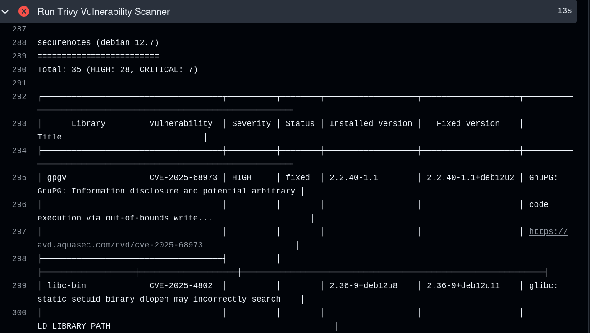

# SecureNotes DevSecOps Security Pipeline

SecureNotes is a Flask-based notes management application integrated with a DevSecOps CI/CD security pipeline. The project demonstrates containerization, automated vulnerability scanning, Dockerfile static analysis, and CI/CD security enforcement using Docker, GitHub Actions, Trivy, and Hadolint.

---

## Technologies Used

* Flask
* SQLite
* Docker
* GitHub Actions
* Trivy
* Hadolint
* Bootstrap

---

## System Architecture


---

## Features

* User registration and login
* Session-based authentication
* Create, edit, and delete notes
* Dockerized deployment
* Automated CI/CD workflow
* Dockerfile static analysis using Hadolint
* Vulnerability scanning using Trivy
* Automatic build failure on HIGH/CRITICAL vulnerabilities

---

## Project Structure

```text
SecureNotes-DevSecOps/
│
├── .github/
│   └── workflows/
│       └── security.yml
│
├── images/
├── static/
├── templates/
├── app.py
├── models.py
├── requirements.txt
├── Dockerfile
├── .dockerignore
└── README.md
```

---

## Docker Setup

### Build Docker Image

```bash
docker build -t securenotes .
```

### Run Docker Container

```bash
docker run -p 5000:5000 securenotes
```

Open:

```text
http://127.0.0.1:5000
```

---

## CI/CD Security Pipeline

The GitHub Actions workflow automatically:

* Builds Docker images
* Performs Dockerfile static analysis
* Scans OS packages and dependencies
* Fails builds on HIGH/CRITICAL vulnerabilities

---

## Trivy Vulnerability Scan



---

## Security Improvements Implemented

* Pinned dependency versions
* Improved Dockerfile structure
* Added automated vulnerability scanning
* Added CI/CD security enforcement
* Reduced dependency vulnerabilities

---

## Learning Outcomes

This project helped in understanding:

* Docker containerization
* CI/CD automation
* DevSecOps workflow integration
* Vulnerability management
* Static security analysis
* Container security best practices
